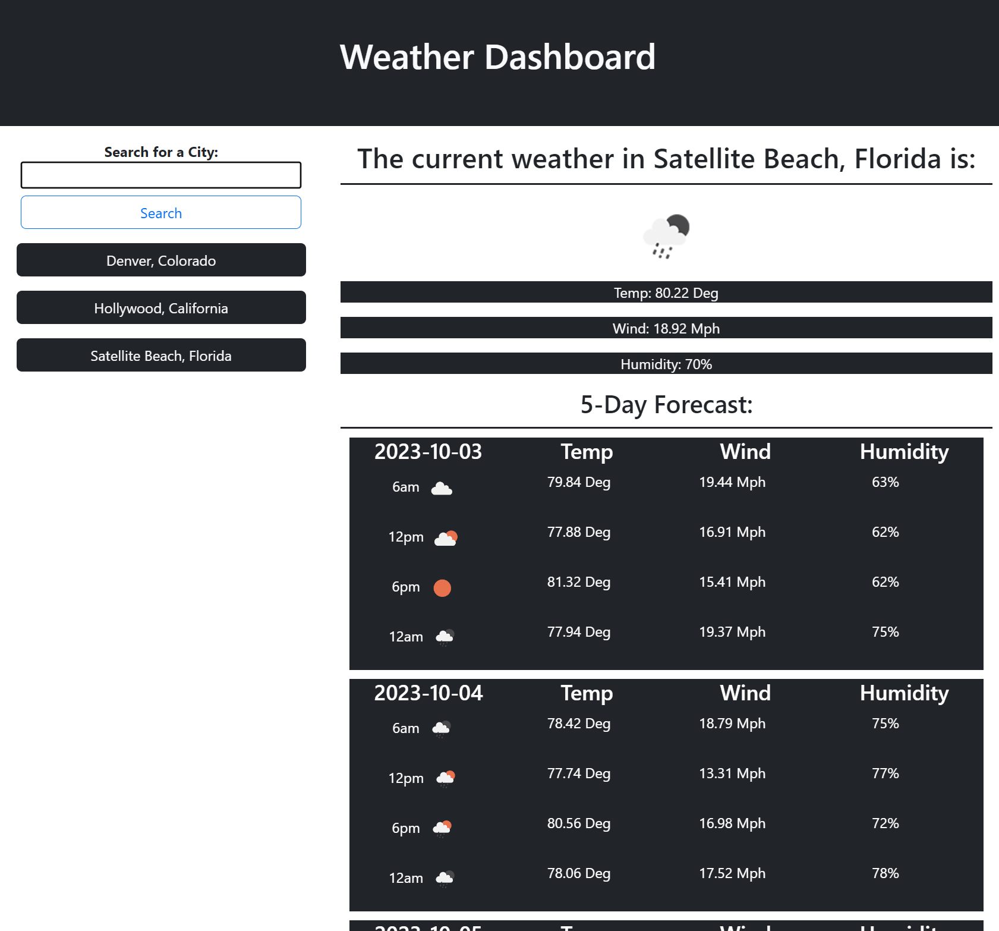

# weather-app
An application for checking current and future weather conditions all over the world.

## Description

This is a website I have designed and coded to showcase my growing skills as a growing web developer.
With this website you can plan a trip by checking weather all over the world.

## Usage

There are no steps to installing this website all the functionality is located at:
https://andrewross4224.github.io/weather-app/

Once on the page you can type a city into the search bar and the website will display current and future weather conditions for that city. Your search will be saved on the side bar for easy repeat access.

## Website Image

## Languages Used

This website uses: JavaScript, HTML, and CSS.

## Credits

https://openweathermap.org/api

this API provides the data used to make the website functional.
including: Icons, Temperature, Humidity, Wind, and other data

## License

MIT license